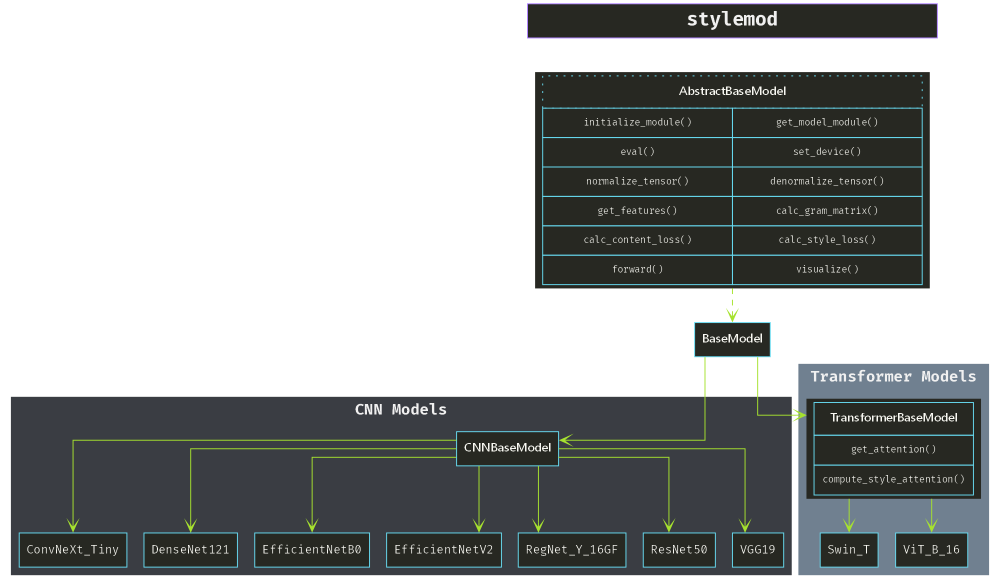

# stylemod

**Modular neural style transfer (NST) library designed to make it easy to integrate and customize different deep learning models for artistic style transfer.**

## Table of Contents

- [Installation](#installation)
- [Architecture](#modular-architecture)
- [Models](#model-superclasses)
  - [BaseModel](#basemodel)
  - [CNNBaseModel](#cnnbasemodel)
  - [TransformerBaseModel](#transformerbasemodel)
- [CLI Usage](#cli-usage)
- [License](#license)

### Key Features

- Plug-and-play architecture for integrating new models.
- Support for CNN-based and Transformer-based models.
- Easy customization of style and content loss computation.
- Command-line interface (CLI) for easy interaction.
- Provides out-of-the-box functionality for managing models, utilized layers/weights, normalizations, and more.

### Modular Architecture

Here is a visualization of the class hierarchy for the `stylemod` library:



## Installation

1. **Clone the repository**:

   ```bash
   git clone https://github.com/ooojustin/stylemod.git
   cd stylemod
   ```

2. **Install dependencies**:
   Make sure you have PyTorch and other required libraries installed:

   ```bash
   pip install -r requirements.txt
   ```

3. **Install Graphviz** (Optional):
   If you wish to use the built-in Graphviz integration for architecture visualization, ensure Graphviz is installed:

   - **Windows**  
     You can download Graphviz for Windows from the official website:  
     [Windows Download](https://graphviz.gitlab.io/_pages/Download/Download_windows.html)

     Alternatively, you can install it using popular package managers:

     ```bash
     # Using Chocolatey
     choco install graphviz

     # Using Scoop
     scoop install graphviz
     ```

   - **Unix-based Systems**

     ```bash
     # For Linux (Debian/Ubuntu)
     sudo apt-get install graphviz

     # For Linux (Red Hat/CentOS)
     sudo yum install graphviz

     # For macOS
     brew install graphviz
     ```

   > **Note**: If you try to invoke `stylemod.generate_class_hierarchy` without graphviz installed, stylemod will attempt to install it automatically via your package manager on Linux/MacOS.

## Model Superclasses

- #### BaseModel

  The `BaseModel` class is the foundational abstract class that all neural style transfer models must inherit.

- ### CNNBaseModel

  The `CNNBaseModel` extends `BaseModel` and implements style transfer specifically for CNN-based models like VGG, ResNet, etc.

- ### TransformerBaseModel

  The `TransformerBaseModel` extends `BaseModel` for transformer architectures (e.g., ViT, Swin-T). Note that transformers may require additional processing for attention maps.

## CLI Usage

stylemod also includes a command-line interface to perform style transfer and visualize the projects class hierarchy.

  - ### Running Style Transfer from CLI

    ```bash
    python -m stylemod run --content-image "img/content.jpg" --style-image "img/style.jpg" --model VGG19
    ```

- ### Visualizing Class Hierarchy

    ```bash
    python -m stylemod class-hierarchy --save --show-funcs
    ```

## License

stylemod is licensed under the MIT License. See the [LICENSE](./LICENSE) file for details.
